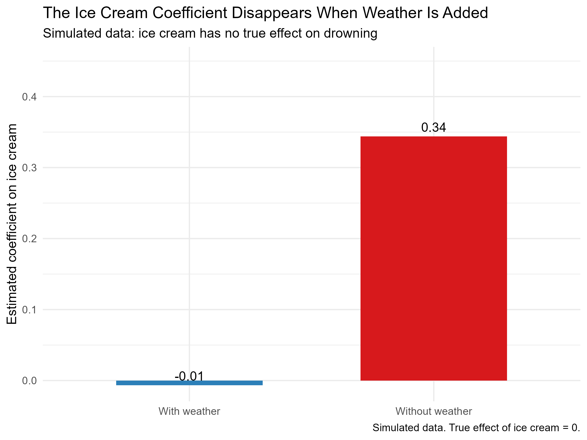
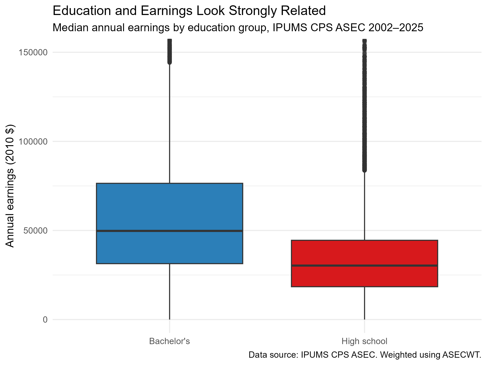
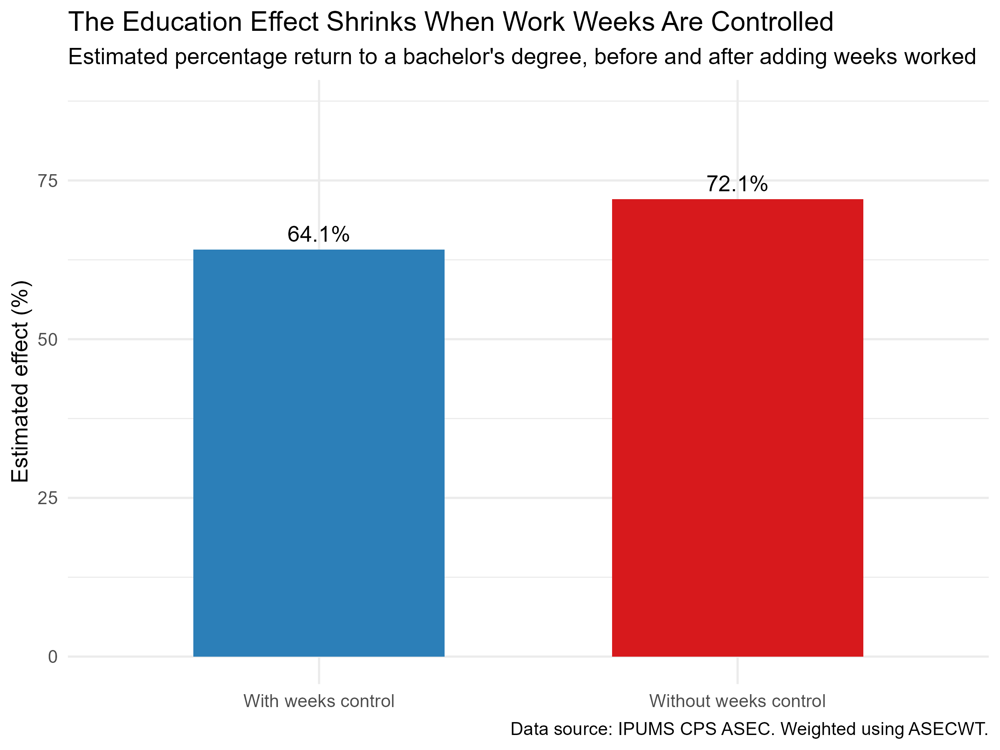

## Introduction

Ice cream sales and drowning deaths rise together every summer.
Run a simple regression of drownings on ice cream sales, and the
coefficient comes out "statistically significant." Someone could
argue from that coefficient that ice cream causes drowning.

But the two are not causing each other. They are both driven by a
third variable: hot weather. Hot days send people to the beach and
to the ice cream truck at the same time. When that third variable
is missing from the regression, the coefficient on ice cream
quietly picks up weather's effect.

This is **omitted variable bias (OVB)**. It is one of the most
common mistakes in applied economics, and it is dangerous
because it does not announce itself. The coefficient looks
significant, the t-statistic is large, and the model fits the
data — but the estimate is wrong.

This post has two goals. First, to explain OVB clearly with a
simulated example. Second, to show that the same bias appears
in **real data** — using a large microdata sample from the
IPUMS Current Population Survey. The question is simple: **when
we control for a variable that belongs in the model, how much
does the estimated effect change?**

## A Tiny Demo: Ice Cream and Drowning

I generated data where weather drives both ice cream sales and
drownings, and ice cream has *no* causal effect on drowning.
Then I ran two regressions:

- **Model 1**: `drowning ~ icecream` (weather omitted)
- **Model 2**: `drowning ~ icecream + temp` (weather included)

The results are stark. Without weather, the ice cream coefficient
is about **0.34** — large and statistically significant. Add
weather, and it collapses to about **−0.01**, essentially zero.

The 0.34 was not ice cream's effect on drowning. It was weather's
effect, hiding inside the ice cream variable. This is OVB in its
purest form.

{width=90%}

### The Formula

The bias has a simple form. Suppose the truth is:

```
y = β₁x + β₂z + u
```

but you estimate `y ~ x` (leaving `z` out). The coefficient on
`x` converges to:

```
β₁ + β₂ · δ,   where  δ = Cov(x, z) / Var(x)
```

The bias is `β₂ · δ`: how strongly the omitted variable affects
`y` (β₂), times how tightly it moves with `x` (δ). For ice cream,
both are positive, so the estimate comes out too big. And you can
often predict the direction of the bias by thinking about those
two signs.

## The Same Bias in Real Data

The ice cream case is obvious. In real economic data, OVB is
much harder to see.

I used microdata from the **IPUMS Current Population Survey
(ASEC)**, covering U.S. workers aged 25–64 from 2002 to 2025.
The sample is restricted to high school graduates and bachelor's
degree holders. All statistics use the `ASECWT` sampling weight
so they represent the U.S. population, not just the survey
sample. Earnings are adjusted to 2010 dollars.

The question: **how much does a bachelor's degree raise
earnings?** This is exactly the kind of question where OVB
matters, because a degree is correlated with many other things
— including how many weeks a person works during the year.

### What the Raw Data Looks Like

{width=90%}

Bachelor's degree holders clearly earn more than high school
graduates. The difference is large and consistent. If you stopped
here, you would conclude that education has a strong effect on
earnings.

### Two Models, Two Answers

I estimated two regressions, both weighted using the CPS survey
design:

- **Model 1**: `log(income) ~ bachelor's degree`
- **Model 2**: `log(income) ~ bachelor's degree + weeks worked`

Model 1 omits weeks worked. Model 2 controls for it.

{width=90%}

The result mirrors the ice cream example. Without controlling
for weeks worked, the estimated return to a bachelor's degree
is **72.1%**. Once weeks worked is added to the model, the
estimated return falls to **64.1%** — a drop of about 8
percentage points.

That 8-point gap is the bias. Part of what looked like an
"education effect" was actually a "weeks worked" effect. Workers
with a bachelor's degree tend to work more weeks per year, and
a model that ignores this attributes the entire earnings
difference to education alone.

## What This Means

The lesson is not that education has no effect. Education clearly
does raise earnings — even after controlling for weeks worked,
the estimated return is still 64%. The lesson is that **the size
of the estimated effect depends on what else is in the model**,
and that this is not a technicality — it changes the number you
report.

Three practical takeaways:

1. **A significant coefficient is not proof of a causal
   relationship.** It only tells you the correlation is unlikely
   to be due to chance. It says nothing about whether the
   variable you included is the one doing the work.

2. **Think about what is missing before you interpret a
   coefficient.** In the ice cream case, the missing variable is
   obvious. In the education case, it takes more thought — but
   the logic is the same: what else could be driving both `x`
   and `y`?

3. **The fix is usually to add the missing variable — or use a
   method that does not require observing it.** Panel data with
   fixed effects, instrumental variables, and regression
   discontinuity are all tools for handling OVB when the
   omitted variable cannot be measured directly.

## Conclusion

Omitted variable bias is not a rare edge case. It is the default
outcome when a regression leaves out something that matters. The
ice cream example makes the mechanism vivid; the CPS example
shows that it affects real estimates of real economic questions.

**The takeaway for a reader is this:** when you see a
"statistically significant" coefficient, the first question
should not be *"is it significant?"* It should be *"what is
missing from this model, and which way would it push the
estimate?"* That question is where careful empirical work begins.

## Limitations

- **This is a demonstration, not a causal estimate.** The
  education regression illustrates OVB mechanics; it is not a
  credible estimate of the return to college. Credible estimates
  require panel data and careful identification.
- **Weeks worked is only one omitted variable.** Education is
  correlated with many other factors (family background, ability,
  location, industry). Adding weeks worked reduces the bias but
  does not eliminate it.
- **The simulated example uses one random seed.** The numbers
  shown are specific to that seed, though the qualitative
  pattern is stable across seeds.
- **CPS income data are topcoded.** Very high earners are
  replaced with top values, which compresses the upper tail and
  can affect regression coefficients.

---

*Data source: [IPUMS CPS](https://cps.ipums.org/), Annual
Social and Economic Supplement, 2002–2025. All statistics are
weighted using `ASECWT`. Earnings are adjusted to 2010 dollars
using CPI-U. Full code is available in the
[project repository](https://github.com/chelseacui0219-hue/blog1).*