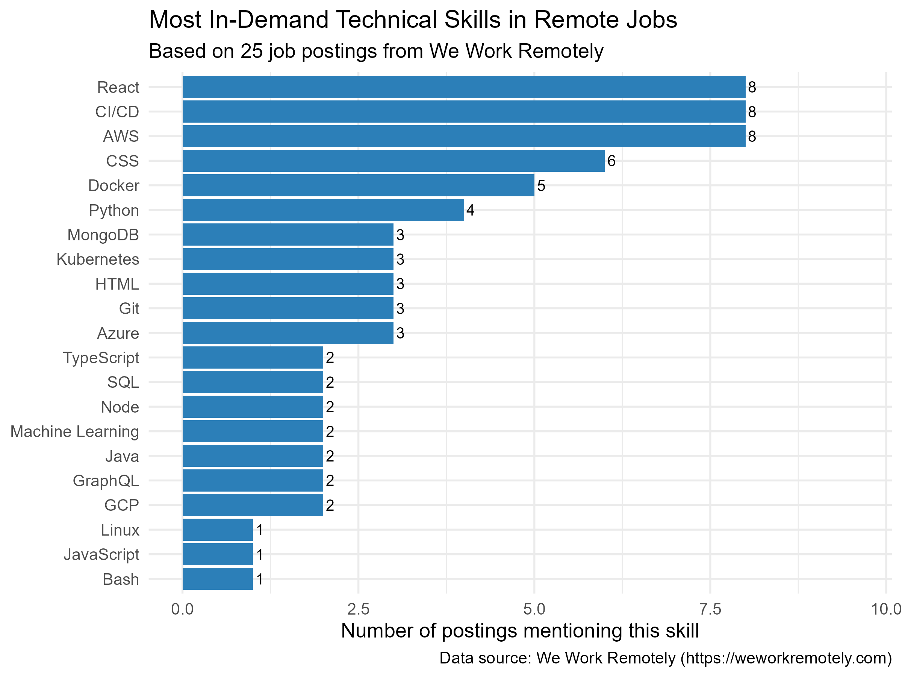
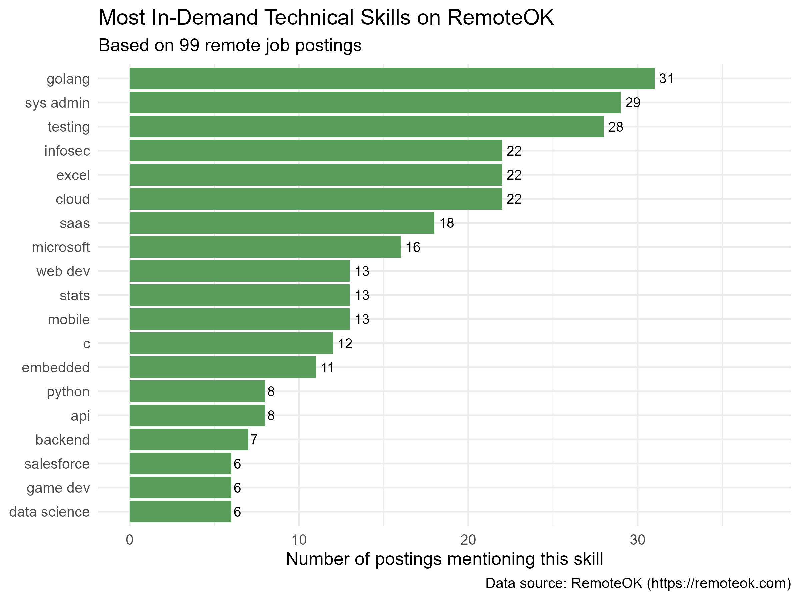
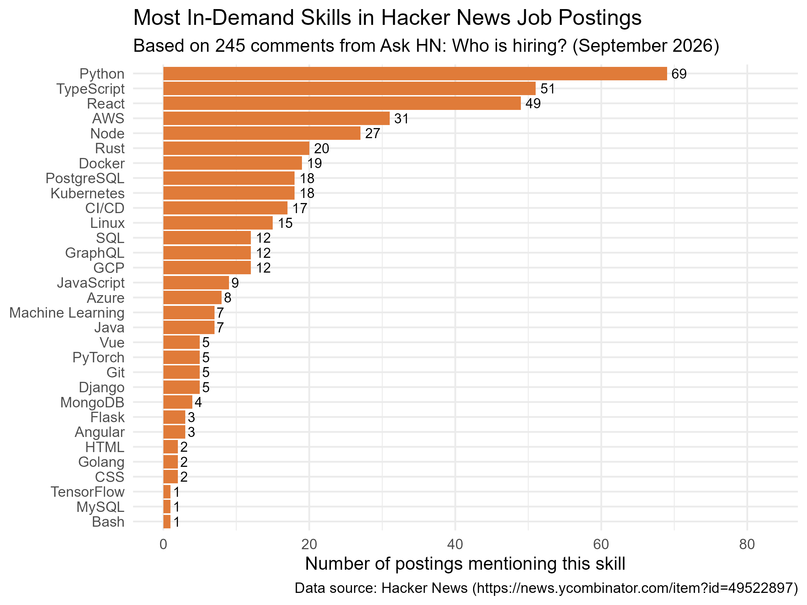

## Introduction

Tech hiring has always been competitive, but the skills employers
ask for shift constantly. With hundreds of languages, frameworks,
and tools competing for attention, it is hard to know where to
focus your learning.

This analysis scrapes job postings from three independent sources
to answer a simple question:

**Which technical skills appear most frequently in tech job
postings?**

The answer turns out to be surprisingly consistent across
platforms.

## Where the Data Comes From

I collected job postings from three different platforms, each
representing a different slice of the tech hiring market:

| Source | What it covers | Postings |
|--------|---------------|----------|
| **RemoteOK** | A curated remote-first job board with structured skill tags | 99 |
| **We Work Remotely** | A remote-only job board with detailed descriptions | 25 |
| **Hacker News "Who is Hiring?"** | Global startup and tech hiring, updated monthly | 245 |

Together these sources cover a wide range of employers: from
remote-first startups to established tech companies and
traditional firms hiring across onsite, hybrid, and remote
arrangements.

Three sources are better than one. Each platform attracts a
different kind of employer, so combining them reduces the risk
of drawing conclusions from a single, biased sample.

## The Skills That Keep Appearing

The clearest pattern across all three datasets is the dominance
of **Python**. It appears in 69 of the 245 Hacker News postings
(28%), and it ranks among the top skills on the other two
platforms as well.

Let's look at each source in turn.

### We Work Remotely: 25 Remote Tech Postings

{width=90%}

React leads the pack, appearing in 40% of postings, followed
closely by AWS and CI/CD. The pattern here points to a
**cloud-native, frontend-heavy** skill set — exactly what you
would expect from a remote-only job board.

### RemoteOK: 99 Remote-First Postings

{width=90%}

RemoteOK's tag data tells a different story. **Go** and
**system administration** dominate, reflecting a user base of
infrastructure engineers and DevOps specialists. Backend
skills are more prominent here than on the other platforms.

### Hacker News: 245 Global Tech Postings

{width=90%}

The Hacker News sample is the largest and most diverse. **Python**
leads with 69 mentions (28%), followed by **TypeScript** and
**React**. This is the startup-heavy, full-stack profile —
engineers who are expected to work across the entire product.

## How the Three Platforms Compare

The most interesting finding is not what the platforms agree on,
but where they differ.

| Platform | Most distinctive skill | Likely reason |
|----------|----------------------|---------------|
| We Work Remotely | **React** (40% of postings) | Curated board attracts design-forward companies |
| RemoteOK | **Go / sys admin** | User base of infrastructure engineers |
| Hacker News | **Python** (28% of postings) | Startup-heavy community, full-stack roles |

> **The takeaway:** There is no single "tech job market."
> Different platforms serve different segments, and the skills
> that matter depend on which segment you are targeting.

## What This Means If You're Learning

If you are preparing for a career in tech — or planning what to
study next — the data suggests a clear priority order:

**1. Learn Python first.**
It is the only language that appears near the top of every
platform. It works for backend engineering, data analysis,
automation, and increasingly for AI.

**2. Add React.**
Frontend skills are not optional. Even backend-leaning roles
increasingly expect familiarity with a modern JavaScript
framework.

**3. Build cloud and DevOps literacy.**
AWS, Docker, and CI/CD appear together so often that they are
effectively a single requirement. You do not need to be a
specialist, but you do need to be comfortable.

**4. Learn one database well.**
PostgreSQL is the safest choice, but MongoDB is also common.
The specific choice matters less than having real experience
with schema design and queries.

## What This Analysis Cannot Tell You

A few honest limitations:

- **It is a snapshot.** The data was collected in September 2026
  and reflects one moment in a fast-moving market.
- **Job postings are not hires.** Employers list many skills they
  never actually test for. Advertised demand is a rough proxy
  for real demand.
- **Keyword counting is imprecise.** A posting that mentions
  "Python" once counts the same as one that mentions it ten times.
- **Not all postings are remote.** The Hacker News sample
  includes onsite and hybrid roles. This makes the findings
  broader, but less specific to remote-only hiring.

These limitations do not undermine the findings — the patterns
are strong enough to be meaningful — but they are worth keeping
in mind.

## Conclusion

Across three independent data sources and nearly 400 job postings,
the same skills keep appearing: **Python, React, AWS, Docker, and
CI/CD**.

The specific mix varies by platform, but the core toolkit is
remarkably consistent. For anyone preparing for a career in tech,
the path is clear: start with Python, add frontend and cloud
skills, and build real projects that demonstrate you can ship.

The data does not predict the future. But it does describe the
present — and the present is a good place to start.

---

*Data sources: [RemoteOK](https://remoteok.com),
[We Work Remotely](https://weworkremotely.com), and
[Hacker News](https://news.ycombinator.com/item?id=49522897).
All scraping was done ethically using public RSS feeds, APIs,
and HTML pages.*