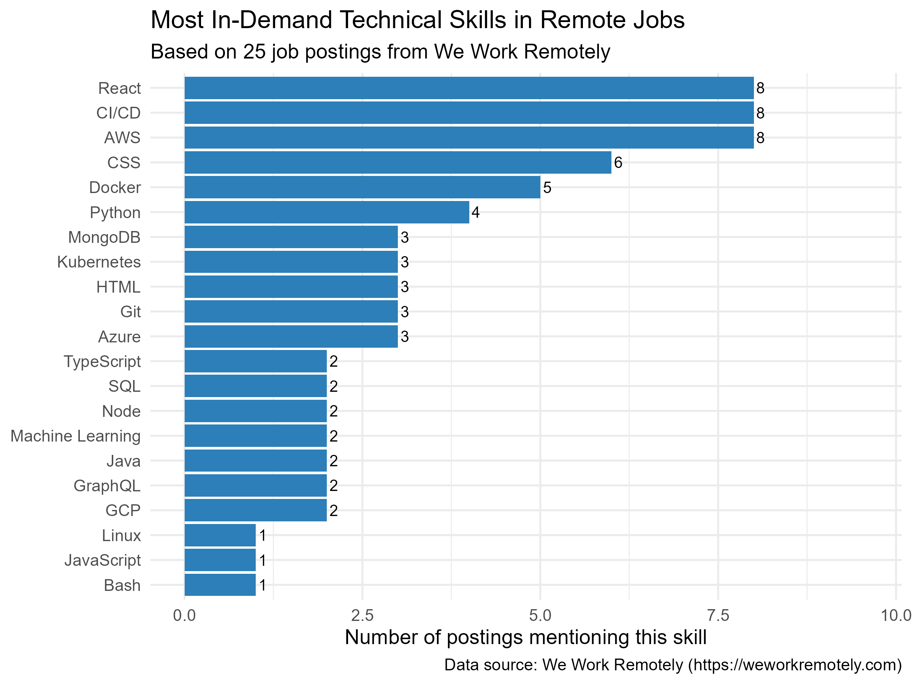
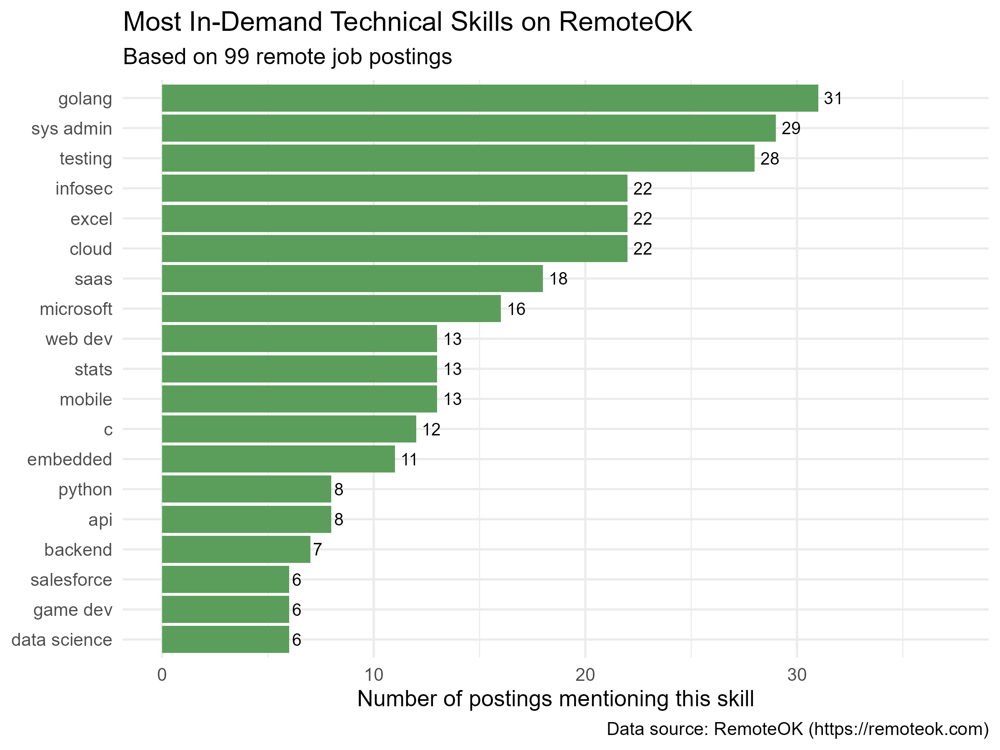
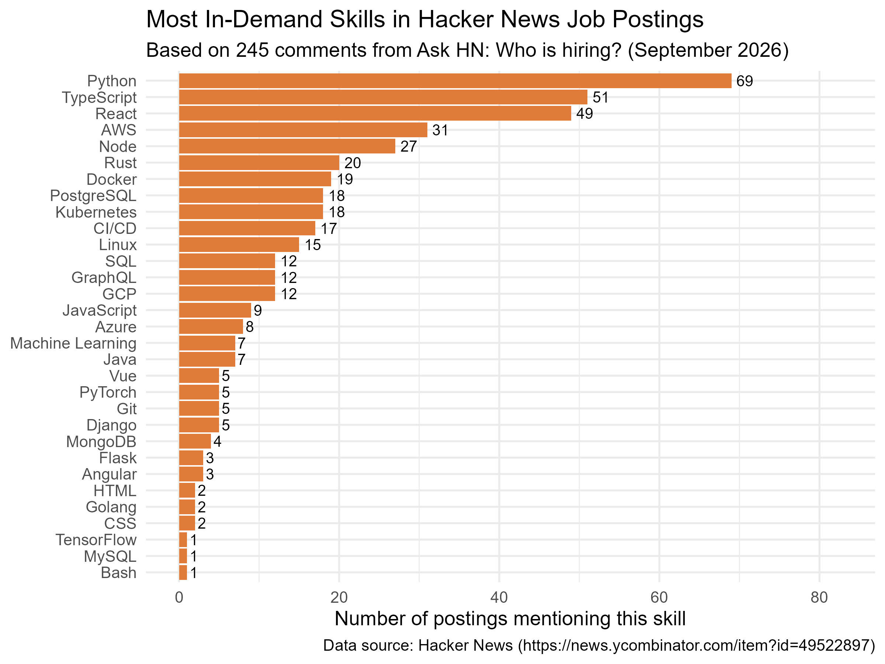

## Introduction

Anyone trying to break into tech today faces the same question:
what should I learn first? The answer is not obvious. There are
hundreds of programming languages, frameworks, and tools, and
the ones that employers ask for change from year to year. A
skill that was essential five years ago may now be optional,
and a tool that barely existed a decade ago may now appear in
a quarter of all job postings.

This matters beyond individual career decisions. Employers use
job postings to signal what they value. When those signals
change, they reveal something about how the tech industry is
evolving — which roles are growing, which technologies are
becoming standard, and which parts of the market are pulling
in different directions.

This analysis scrapes job postings from three independent
sources to answer the question:

**Which technical skills appear most frequently in tech job
postings — and do different hiring markets demand different
skills?**

The answer turns out to be more complicated and depending on the market.
The skills that dominate one platform are not the same skills
that dominate another. That finding is the core of this post.

## Where the Data Comes From

I collected job postings from three different platforms, each
representing a different slice of the tech hiring market:

| Source | What it covers | Postings |
|--------|---------------|----------|
| **RemoteOK** | A curated remote-first job board with structured skill tags | 99 |
| **We Work Remotely** | A remote-only job board with detailed descriptions | 25 |
| **Hacker News "Who is Hiring?"** | Global startup and tech hiring, updated monthly | 245 |

Together these sources cover a certain amount of employers and postings, such as tech companies including startups and traditional companies that hiring across onsite, hybrid, and remote arrangements.

Each platform attracts a different kind of employer, so combining them reduces the risk
of drawing conclusions from a single, biased sample.

## The Skills That Keep Appearing in traditional tech-postings are not dominating the remote labor market

From the data, though three platforms are focusing on similar industries, the required abilities are quite different. For traditional Hacker News, **Python** dominates the postings.It appears in 69 of the 245 postings
(28%). However, the requirement numbers for Python is other two remote platform are much lower. Especially for RemoteOK, there are only 8 postings mentioned Python in their postings. 

### We Work Remotely: 25 Remote Tech Postings

{width=90%}

React leads the pack, appearing in 40% of postings, followed
closely by AWS and CI/CD. The pattern here points to a
**cloud-native, frontend-heavy** skill set — exactly what you
would expect from a remote-only job board. Then Docker and Python are also been noticed by several postings. 

### RemoteOK: 99 Remote-First Postings

{width=90%}

RemoteOK's tag data tells a different story. **Go** and
**system administration** dominate, reflecting a user base of
infrastructure engineers and DevOps specialists. Backend
skills are more prominent here than on the other platforms.

### Hacker News: 245 Global Tech Postings

{width=90%}

The Hacker News sample is the largest and most diverse. **Python**
leads with 69 mentions (28%), followed by **TypeScript** and
**React**. This is the startup-heavy, full-stack profile —
engineers who are expected to work across the entire product.

## How the Three Platforms Compare

The most interesting finding is not what the platforms agree on,
but where they differ.

| Platform | Most distinctive skill | Likely reason |
|----------|----------------------|---------------|
| We Work Remotely | **React** (40% of postings) | Curated board attracts design-forward companies |
| RemoteOK | **Go / sys admin**(30% of postings) | User base of infrastructure engineers |
| Hacker News | **Python** (28% of postings) | Startup-heavy community, full-stack roles |

## Conclusion  
Across three independent sources and 369 job postings, the data
does not point to a single "most in-demand" skill. Instead, it
shows a **segmented market**:

- **Hacker News** (startup / full-stack): Python leads at 28%,
  followed by TypeScript and React.
- **We Work Remotely** (product-oriented remote companies):
  React leads at 40%, with AWS and CI/CD close behind.
- **RemoteOK** (infrastructure / DevOps): Go and system
  administration dominate.

The only skills that appear near the top on **more than one**
platform are **Python** and **React**. Cloud and DevOps tools
(AWS, Docker, CI/CD) recur across platforms but never as the
single top skill.

For someone unsure which segment to target, a low-regret
starting point would be Python and React first, then
cloud/DevOps literacy.

**The broader lesson is methodological.** "What skills are in
demand?" sounds like a simple question, but it is not
well-defined until you specify the market. Different platforms
serve different employers, and the skills that matter depend
on which segment you are targeting. A job seeker who looks at
only one platform may draw the wrong conclusion about what to
learn — and a researcher who looks at only one platform may
draw the wrong conclusion about what the tech industry values.

## What This Analysis Cannot Tell You

A few honest limitations:

- **It is a snapshot.** The data was collected in September 2026
  and reflects one moment in a fast-moving market.
- **Job postings are not hires.** Employers list many skills they
  never actually test for. Advertised demand is a rough proxy
  for real demand.
- **Keyword counting is imprecise.** A posting that mentions
  "Python" once counts the same as one that mentions it ten times.

These limitations do not undermine the findings — the patterns
are strong enough to be meaningful — but they are worth keeping
in mind.

---

*Data sources: [RemoteOK](https://remoteok.com),
[We Work Remotely](https://weworkremotely.com), and
[Hacker News](https://news.ycombinator.com/item?id=49522897).
All scraping was done ethically using public RSS feeds, APIs,
and HTML pages.*