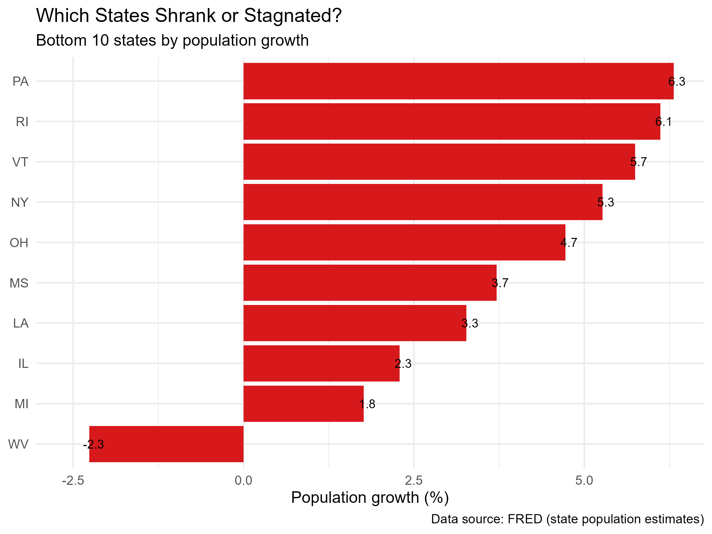
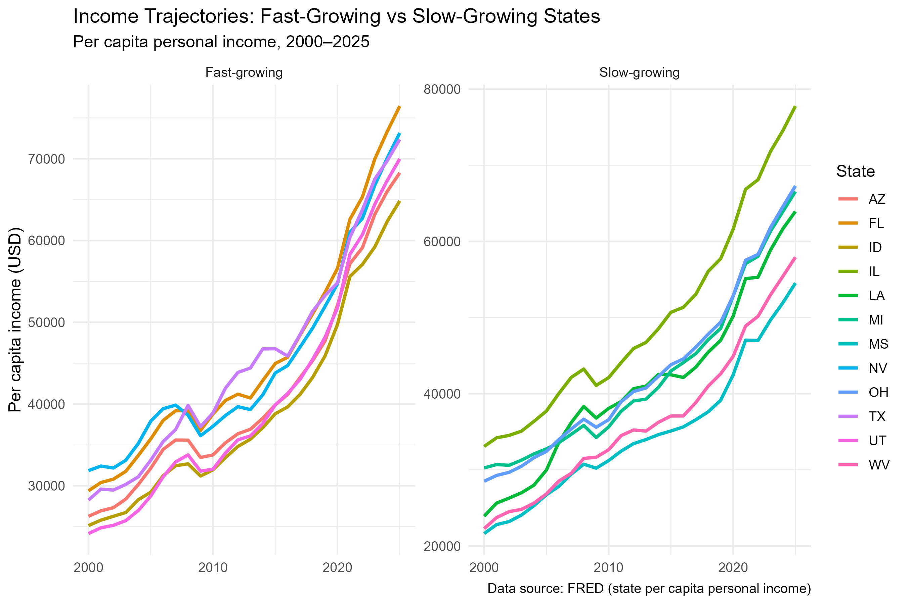

## Introduction

Every year, hundreds of thousands of Americans move between
states. They leave the Northeast and Midwest for the Sun Belt,
chasing lower taxes, cheaper housing, and new job opportunities. Meanwhile, there are also immigrants from foreign countries entering different states. Their choice also includes consideration to their new life condition.
Between 2000 and 2025, Nevada's population grew by 63%, Utah's
by 58%, and Texas's by 51%. Meanwhile, West Virginia lost
population, and Illinois barely grew at all.

This migration is not just a demographic fact. It is often
treated as a signal of economic success. States that attract
new residents are said to be "winning" — they have jobs,
opportunities, and a future. States that lose residents are
said to be "declining."

But is that true? Does population growth actually mean that the
people living in a state are becoming richer? Or are migrants
moving to places that are cheaper — not necessarily more
prosperous?

This analysis uses data from the **Federal Reserve Economic Data
(FRED)** system to examine population and income trends across
all 50 U.S. states (plus D.C.) from 2000 to 2025. The data is
retrieved programmatically through the `fredr` R package, so
the entire analysis is reproducible.

The answer, it turns out, is more nuanced than the headline
numbers suggest. **Population growth and income growth are two
different things** — and confusing them can lead to the wrong
conclusions about which states are doing well.

## How to measure

I used two annual series for each state:

- **Population** (`{state}POP`) — resident population in thousands
- **Per capita personal income** (`{state}PCPI`) — total personal
  income divided by population, in current dollars

Using per capita income is essential
when comparing states of different sizes.

All figures are in current (nominal) dollars. Real growth
after inflation would be lower; this is discussed in the
Limitations.

I collected data for all 51 jurisdictions (50 states plus the
District of Columbia) from 2000 through 2025 — about 2,652
observations in total.

## Finding 1: Growth Is Concentrated in the West and South

{width=90%} 

The fastest-growing states are all in the West and South:
**Nevada (+63%), Utah (+58%), Idaho (+56%), Texas (+51%),
Arizona (+48%), and Florida (+46%)**.

{width=90%}  

The slowest-growing states are all in the Midwest and Northeast:
**West Virginia (-2.3%), Michigan (+1.8%), Illinois (+2.3%),
Louisiana (+3.3%), and Mississippi (+3.7%)**.

West Virginia is the only state that **lost population** over
the period. This is consistent with long-running trend of out-migration of young workers, declining coal
employment, and an aging population in that area.

## Finding 2: Population Growth Does Not Mean Income Growth

{width=90%}

If population growth were a sign of economic success, we would
expect the fastest-growing states to also show the fastest
income growth. However, the data shows no such relationship. According to the scatter plot, it shows only a weak, noisy-positive relationship.

For example: **Nevada** has a population growth of 63%, which is the highest in the
  country, but has a nominal income growth of only 135%. Meanwhile, **Utah** has a similar population growth of 58%, but Utah's nominal per capita income grew roughly 190% versus Nevada's 135%. In this case, the relationship between income and population growth is relatively week.

## Finding 3: Income Growth Differ More Among Slow-Growing States

{width=90%}

Then, we collected the income growth data for the six fastest-growing states and the six slowest-growing states in terms of population growth.

Among **population-fast-growing states**, per capita income range is relatively
narrow: all six states end the period between $65,000 and $77,000.

Among **population-slow-growing states**, the range is much wider:
Illinois reaches nearly $80,000 by 2025, while Mississippi
remains near $55,000.

In this case, **Population growth is not a
signal of prosperity, but population stagnation is not a signal of decline either.** Illinois has one of the highest per capita incomes in the country while its population has remained roughly flat.The reason is that both population inflow and outflow exist in each state. If a state is attracting high-skilled immigrants while those leaving the state were the middle and low-income locals, the income per capita for the state would increase while population would remain stable.

## Conclusion

This analysis leads to three takeaways:

1. **Population growth is not a reliable indicator of income
   growth.** Nevada and Utah both grew quickly, but their
   income growth was very different. Meanwhile, Illinois's
   population remained flat while its per capita income grew
   steadily.

2. **Income growth is not driven by the net change in
   population.** The two variables are only weakly correlated.
   The people who leave a state and the people who arrive are
   different in income, skills, and consumption behavior. As a
   result, income is affected by who is in the population, not
   just how many people there are.

3. **The composition of migration matters more than the
   headline number.** A state can grow quickly and remain
   poor, or stagnate and remain rich. The interesting question
   is not "how many people moved in?" but "who moved in, and
   who moved out?"

**What should a reader take away from this?** If you are
deciding where to live, do not assume that population fast-growing states
are richer or that population slow-growing states are declining. The two
are only loosely connected. Population change is a useful
signal, but it is not the same as economic prosperity.

## Limitations

This analysis has several limitations:

- **Per capita income is a crude measure.** It divides total
  income by total population, including children and retirees
  who do not earn income.
- **No inflation and cost-of-living adjustment.** The analysis use nominal income data so the growth rates reported here include both real income growth and price
  inflation. Meanwhile, a dollar in Mississippi
  buys more than a dollar in California, but this analysis
  treats them as equal.
- **Population estimates, not census counts.** FRED uses
  annual estimates between decennial censuses, which can
  diverge from actual counts.
- **Simple correlation.** The analysis describes patterns,
  not causes. It does not explain why some states grow and
  others do not.
- **Population growth combines natural increase and net migration.** This analysis cannot separate the two, so
statements about migration specifically are not supported.

---

*Data source: [FRED](https://fred.stlouisfed.org/), Federal
Reserve Bank of St. Louis. State population (`{state}POP`) and
per capita personal income (`{state}PCPI`), 2000–2025. All data
retrieved programmatically through the `fredr` R package. Full
code is available in the
[project repository](https://github.com/chelseacui0219-hue/blog4).*